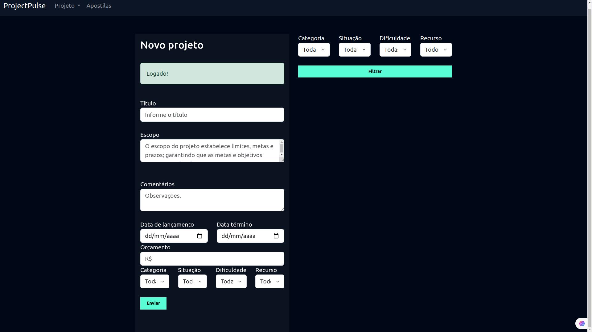

## ProjectPulse 
"O aplicativo foi desenvolvido para facilitar o gerenciamento de projetos e a colaboração em equipe de forma eficiente e intuitiva." 

O **ProjectPulse** é um projeto de desenvolvimento web utilizando Django, um framework em Python. A seguir está uma breve descrição técnica das etapas realizadas no projeto:

<h1 align="center"> Descrição </h1>

### Parte 1: Preparação do Ambiente
    • Criação do diretório 'projectpulse' para o projeto.
    • Abertura do VS Code e criação de um ambiente virtual '.venv'.
       source .venv/bin/activate
    • Instalação das dependências dentro do ambiente virtual:
   	pip3 install django
   	pip3 install pillow
    • Instalação do Python e da biblioteca Pillow para processamento de imagens.
      
### Parte 2: Criação do Projeto Django
    • Criação do app 'core' como o principal projeto 'projectpulse' do Django.
   	django-admin startproject projectpulse .
    • Inicialização do servidor de desenvolvimento.

### Parte 3: Configuração do Banco de Dados com Docker
    • Desinstalação do PostgreSQL local para utilizar o Docker para o controle do banco.
    • Criação de um container Docker para o banco de dados PostgreSQL:
	- Para evitar conflito, houve alteração de porta para 5433.

### Parte 4: Conceitos importantes
    • Utilização do conceito de 'dividir para conquistar' com Django, que envolve dividir a aplicação em pequenos apps para resolver problemas específicos.
    • Utilização do padrão MVT (Model-View-Template) do Django.

### Parte 5: Funcionalidades:

    • Criação do app 'usuarios'.

<table>
  <tr>
    <td align="center">
      
    </td>
    <td align="center">
      
    </td>
  </tr>
</table>

    • Criação do app 'novoprojeto'.
      
<table>
  <tr>
    <td align="center">
      
    </td>
    <td align="center">
      
    </td>
  </tr>
</table>

    • Criação do app 'apostilas'.

<table>
  <tr>
    <td align="center">
      
    </td>
    <td align="center">
      
    </td>
    <td align="center">
      
    </td>
  </tr>
</table>

### Parte 6: Configuração de URLs:
    • Configuração das rotas das aplicações para funcionalidades como, por exemplo: cadastro e login do usuário.

### Parte 7: Configuração de templates:
    • Definição do local onde o Django deve buscar por arquivos de templates. 
    • Criação de template base (arquivo base.html) para ser utilizado por todos os arquivos.

### Parte 8: Tratativas de segurança - confidencialidade:
    • O sistema atende às condições para a vinculação dos projetos a um determinado ambiente.

    - Nesta parte do projeto, foi implementada uma funcionalidade que garante o princípio da confidencialidade no sistema. Isso significa que apenas usuários autorizados têm acesso a determinados projetos e ambientes de trabalho. Por exemplo, somente os projetos de um usuário específico podem ser vinculados ao ambiente desse mesmo usuário, garantindo que cada usuário tenha acesso apenas às suas próprias informações.

    - Em caso de tentativas de acesso não autorizado, o usuário é redirecionado para a página inicial do sistema, garantindo a segurança e a privacidade dos dados. Este princípio de confidencialidade protege as informações contra acessos não autorizados, assegurando a privacidade dos dados do negócio.

    - Uma das estratégias essenciais para garantir a confidencialidade é implementar um controle de acesso rigoroso, como autenticação por senha, para garantir que apenas pessoas autorizadas possam acessar os dados. Essas medidas ajudam a proteger a integridade e a segurança das informações do sistema. 

### Observações Finais para uso do sistema
    Certifique-se de configurar adequadamente as portas para atender aos requisitos de segurança e integração com outros sistemas ao utilizar o Docker em ambientes de produção.

    Essas etapas abrangem desde a preparação do ambiente de desenvolvimento até a configuração do banco de dados PostgreSQL utilizando o Docker para controle.

O ProjectPulse foca no gerenciamento de projetos de forma humanizada, envolvendo toda a equipe. 

Luanna Siqueira curso.siqueira@gmail.com

